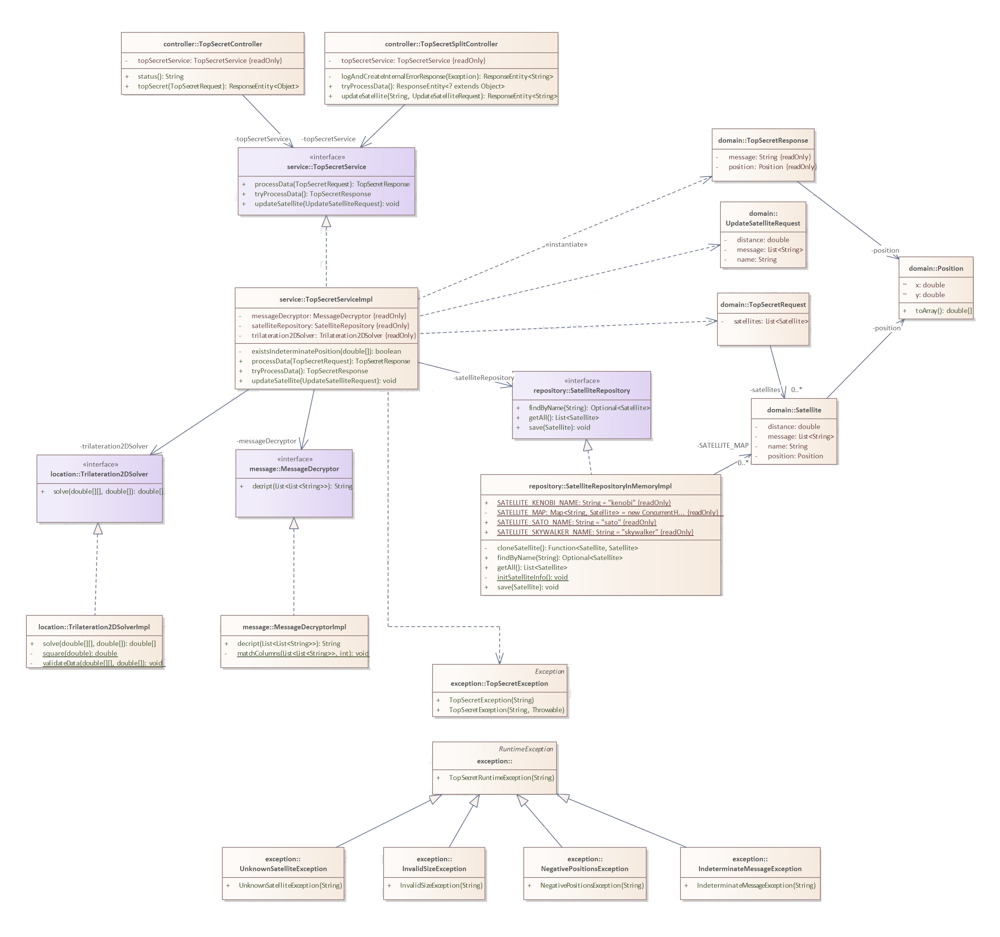
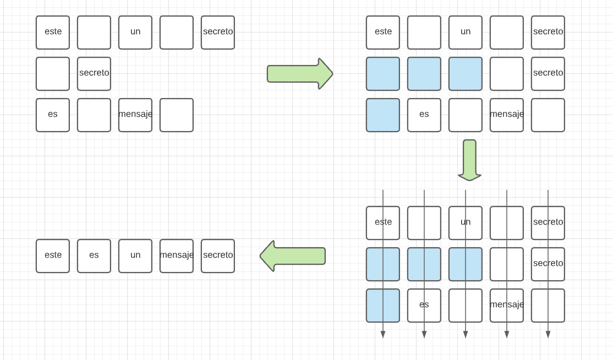
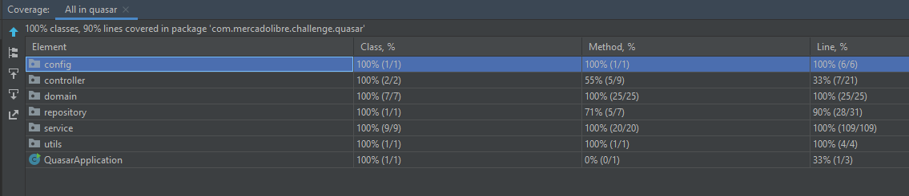

  
# MeliQuasarChallence 

Prueba técnica para Mercado Libre: **"Operación Fuego de Quasar"**    

 # Requerimientos del Proyecto    
    
 En este [PDF](docs/Operacion%20Fuego%20de%20Quasar.pdf) se detallan los requerimientos de la prueba técnica.    
    
# Especificación    
 ## Tecnologías empleadas    
 La aplicación utiliza:    
    
 - Java 11    
 - Maven    
 - Spring Boot 2.4.3    
 - Lombok 1.18.18 [Ver Configuración IDE](https://www.baeldung.com/lombok-ide)    
    
## Diagrama de Clases    
     
    
## Algoritmos    
 ### Detector del Mensaje    
 El algoritmo tiene una complejidad de **O(n) + O(n^2)**, donde **n** es el mayor número de columnas en el arreglo de mensajes. A continuación, los pasos del algoritmo:  
  
  
  
 - n es 5  
 - El desfase se corrige adicionando nuevos elementos al inicio del arreglo (con string.Empty - cuadros azules)  
 - Luego se toman los valores distintos de cada columna  
   - Es case insensitive  
   - Si toda la columna tiene espacios en blanco se descarta  
 - El valor de cada columna será una palabra en el mensaje.  
  
### Cálculo de la Localización  
  
Se construyó con base en el concepto de la **Trilateración en 2D**, algunas de las referencias consultadas:  
  
 - [Conceptualización](https://books.google.co.uk/books?id=Ki2DMaeeHpUC&pg=PA78#v=onepage&q&f=false)  
 - [Sistema de Ecuaciones implementado](https://math.stackexchange.com/questions/884807/find-x-location-using-3-known-x-y-location-using-trilateration/884851#884851?newreg=bd7d92b8caba4dd188df0488c32668b8)  
 - [Validación y pruebas](https://www.desmos.com/calculator/6mbdjcffcp?lang=es)  
  
    
## Cobertura de Código del 90%     
    
## Servicios Rest    
 Se utilizó **Swagger 2** para documentar el Api  https://meliquasar.herokuapp.com/swagger-ui.html    
Algunos ejemplos de Request:    
    
**POST   /api/topsecret**    
    
     curl --location --request POST 'https://meliquasar.herokuapp.com/api/topsecret' \    --header 'Content-Type: application/json' \        
        --data-raw '{    
     "satellites": [          {       
              "name" : "kenobi",        
              "distance" : 100.0,        
              "message" : ["este", "", "", "mensaje", ""]        
     },        
              {        
              "name" : "skywalker",        
              "distance" : 115.5,        
              "message" : [" ", "es", "", "", "secreto"]        
     },        
              {        
              "name" : "sato",        
              "distance" : 142.7,        
              "message" : ["este", "", "un", "", ""]        
     }        
           ]    
     }'    

**POST    /api/topsecret_split/{satellite_name}**    
    
     curl --location --request POST 'https://meliquasar.herokuapp.com/api/topsecret_split/kenobi' \ --header 'Content-Type: application/json' \ --data-raw ' { "distance" : 100, "message" : ["este", "", "", "mensaje", ""] }'    

**GET /api/topsecret_split**     

     curl --location --request GET 'https://meliquasar.herokuapp.com/api/topsecret_split' \ --header 'Content-Type: application/json' \ --data-raw '{ "distance" : 5, "message" : ["este", "", "un", "", ""] }'    
    
# Demo 

La aplicación ha sido desplegada en la plataforma **Heroku**.    
    
### Notas:    
    
- Puede utilizar  https://meliquasar.herokuapp.com/swagger-ui.html para invocar los servicios.    
 - Tenga en cuenta el [Dyno sleeping](https://devcenter.heroku.com/articles/free-dyno-hours#dyno-sleeping) de **Heroku**, esto puede hacer que el primer Request demorare un poco más de lo normal, ya que debe iniciarse la aplicación.    
    
  # Mejoras  
 - Para reducir el código repetitivo se empleó **Lombok** pero creo que si lo hubiese realizado en **Kotlin** no es necesario.  
 - Dado que se desplegó en Heroku se optó por dejar una aplicación monolítica, pero se podría utilizar Azure Functions o AWS Lambda o una aproximación en microservicios.  
 - La implementación `SatelliteRepositoryInMemoryImpl` tiene estado,  lo que impide escalar horizontalmente la aplicación ya que se pueden obtener resultados distintos si el request apunta a diferentes nodos. Se hubiese podido utilizar Redis.